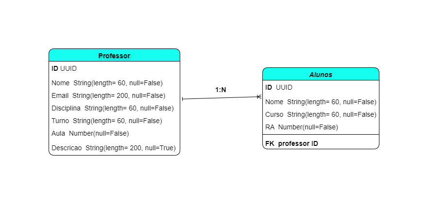

<h1>404-not-found_Backend</h1>

## **1. Projeto**

Essa API foi desenvolvida para facilitar a criação e gerenciamento de listas de presença online em instituições de ensino. Ela se baseia em duas tabelas principais: uma para armazenar informações sobre os professores e outra para os alunos. Aqui está uma descrição mais detalhada de como funciona:

<h3>Tabela de Professores:</h3>

Esta tabela contém informações sobre os professores que ministram as aulas.
Campos típicos podem incluir: ID do professor, nome, email, disciplina, turno, numero da aula e descrição.
A API permite a criação, atualização, consulta e exclusão de registros nesta tabela.

<h3>Tabela de Alunos:</h3>

Esta tabela armazena informações sobre os alunos matriculados nos cursos.
Campos comuns podem incluir: ID do aluno, nome, curso e RA.
Assim como na tabela de professores, a API oferece funcionalidades para gerenciar os registros nesta tabela.

<h3>Listas de Presença:</h3>

A API permite a criação de listas de presença para cada aula, associadas a um professor e a uma turma específica.
As listas de presença são configuradas com data e hora automatica.
Os professores têm a capacidade de visualizar e atualizar as listas de presença, marcando a presença dos alunos.

<h3>Funcionalidades Adicionais:</h3>
Além das operações básicas de CRUD (Create, Read, Update, Delete), a API pode oferece a opção de enviar a lista em formato PDF para o email do professor.

## <strong>Diagrama de classe</strong>

<br><br>

TecnoTecnologias usadas :

-   Python
-   Django

**Base URL: https://https://autentica-ulife.onrender.com**

**Documentação**

https://autentica-ulife.onrender.com/api/schema/

https://autentica-ulife.onrender.com/api/docs/swagger/

## **2. Start the project:**

### Type the command in the terminal:

```json
  Criar Ambiente Venv : python -m venv venv

  Ativar Ambiente Venv : source venv/Scripts/activate -> para Windows // source venv/bin/activate -> para Linux

  Instalar Pacotes : pip install -r requirements.txt

  Preencher informações do banco de dados na pasta ata_online/settings.py DATABASES

  Gerar Migrações : python manage.py migrate

  Para iniciar o servidor local, pasta ata_online/settings.py DEBUG = True

  Iniciar Servidor : python manage.py runserver
```
